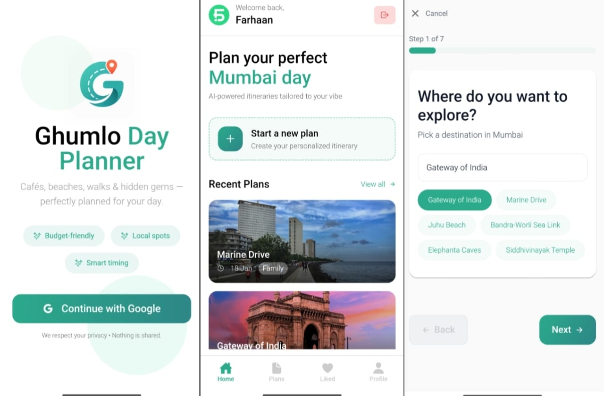
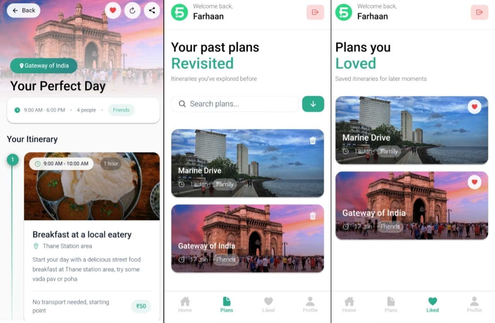

# 🧭 Ghumlo

🌐 Live Web Version: [https://ghumlo.vercel.app](https://ghumlo.vercel.app)

---

## 📖 Description

Ghumlo is an **AI-powered travel planning app built with Expo (React Native)** that helps users create personalized travel itineraries in seconds.

Instead of spending hours researching places, routes, and schedules, users simply enter their destination, trip duration, and preferences — and Ghumlo generates a **complete day-wise travel plan**.

Designed with a **mobile-first approach**, Ghumlo focuses on simplicity, speed, and real-world usability for travelers on the go.

---

## ✨ Features

* 🗺️ **AI Itinerary Generation**
  Generate smart, structured travel plans instantly using AI.

* 📍 **Location-Aware Suggestions**
  Recommends places, activities, and routes based on destination.

* 🕒 **Day-wise Planning**
  Clean breakdown of each day with organized activities.

* 🎯 **Personalized Trips**
  Adapts itineraries based on user preferences and trip duration.

* 📱 **Mobile-First Experience (Expo)**
  Built primarily for mobile using React Native (Expo), with a web version available.

---

## 🚀 Installation (Expo App)

### 1️⃣ Clone the repository

```bash
git clone https://github.com/FSfarhaan/Ghumlo.git
cd ghumlo
```

---

### 2️⃣ Install dependencies

```bash
npm install
```

---

### 3️⃣ Run the app (Expo)

```bash
npx expo start
```

Then:

* Scan QR with Expo Go (Android/iOS)
* Or run on emulator

---

## 🌐 Running Web Version (Optional)

```bash
npm run web
```

Or directly use:
👉 [https://ghumlo.vercel.app](https://ghumlo.vercel.app)

---

## 🛠️ Usage

1. Enter your **destination**
2. Select **trip duration**
3. Add **preferences (optional)**
4. Generate itinerary
5. Follow your plan and travel stress-free ✈️

---

## 🧩 Tech Stack

### 📱 Frontend (Primary)

* **React Native (Expo)** → Mobile-first UI
* **React Navigation** → App navigation

### 🌐 Web Support

* Expo Web (for browser access)

### ⚙️ Backend

* **Node.js** → Handles itinerary logic

### 🧠 AI Integration

* **LLM API** → Generates intelligent travel plans

### 📦 State Management

* Handles user input, itinerary state, and responses

---

## 🤝 Contributing

Contributions are welcome!

If you have ideas to improve:

* UX
* AI quality
* Performance

Feel free to open an issue or submit a PR.

---

## 📸 Screenshots

<!-- Add screenshots here -->




---

## 📬 Contact

📧 [farhaan8d@gmail.com](mailto:farhaan8d@gmail.com)
🔗 [https://www.linkedin.com/in/fsfarhaanshaikh](https://www.linkedin.com/in/fsfarhaanshaikh)

---
